# Running SHARE from the Web UI — Worked Examples

This guide walks through complete jobs submitted from the web UI, one per seeded project plus an
encrypted variant:

1. [**General Statistics** — federated mean and standard deviation of patient age](#example-1-general-statistics--federated-mean-and-standard-deviation)
2. [**Biomarker Model Validation** — validating Cox and logistic models on the MSKChord cohort](#example-2-biomarker-model-validation--survival-analysis-and-calibration-on-mskchord)
3. [**Variant: fully encrypted models** — the same biomarker validation with encrypted model upload](#example-2b-variant-encrypted-model-mode-on-prostate-cancer)

## Prerequisites

- The standalone stack is up (see [standalone/README.md](../../standalone/README.md) or just run
  the launcher for your platform, e.g. `./LAUNCH_ME_LINUX.sh`), and the three demo client
  containers `site1`, `site2`, `site3` are created and running.
- The frontend is reachable at [http://localhost:3000](http://localhost:3000).
- Log in with username **`initiator`** (the seeded `INITIATOR` user, mapped to `site3`).
  The research prototype performs no password validation.

In the seeded demo setup, both projects read from local FHIR bundles staged into the client
containers: the General Statistics project uses the three `Survivability_FHIR_Data_part*.json`
bundles (one per site; the paths are in `standalone/default.env.local` and can be replaced with
your own bundles or FHIR server URLs), and the Biomarker project uses the MSKChord bundles. Model weight/cutoff files for the biomarker project are pre-registered for the
`initiator` user, so no User Settings changes are needed.

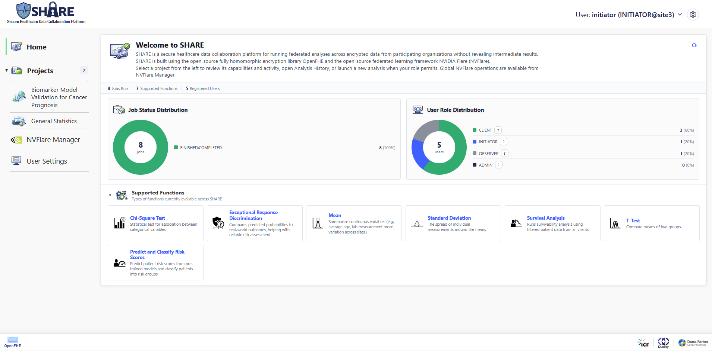

---

## Example 1: General Statistics — federated mean and standard deviation

**What it computes.** The federated mean and population standard deviation of the `Age` column
over the full three-site cohort. Each site encrypts its local sums; the server aggregates
ciphertexts; the ratio is finished in the clear from multiplicatively-masked decryption shares.
Neither the server nor any single site ever sees another site's sums.

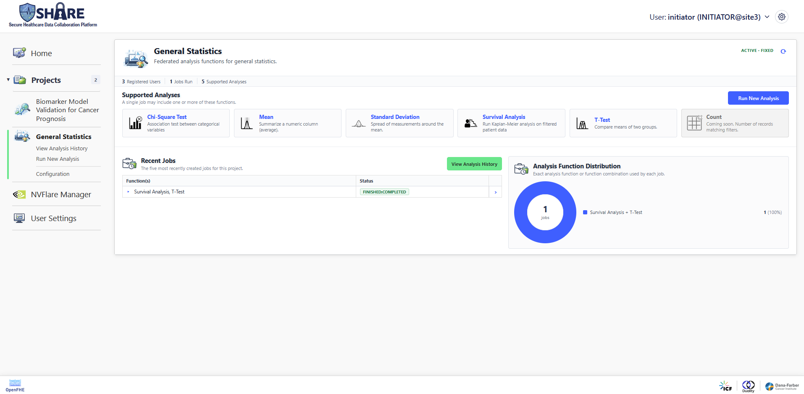

### Steps

1. From the home page, open the **General Statistics** project. The job runner starts on the
   **Filter History** screen. Click **Create New Filter Set**.

   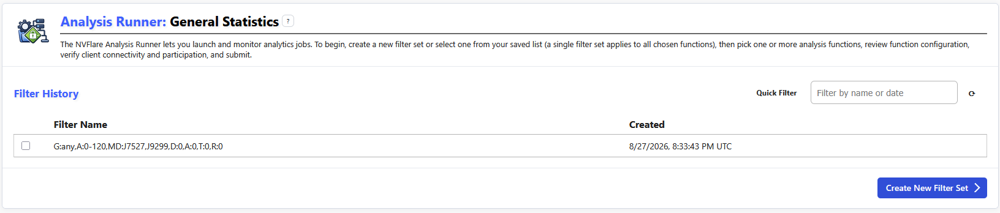

2. **Patient filters** — leave everything at its defaults (the default query selects the whole
   cohort) and continue.

   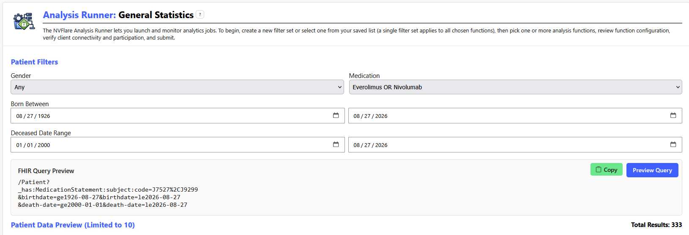

3. **Observation filters** — run the preview query so the screen can fetch observations for the
   selected patients, leave the data filters at their defaults, and continue. (The continue button
   stays disabled until the preview has completed and at least one patient row remains.)

   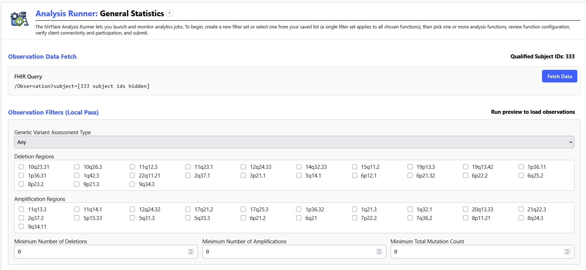

4. **Function selection** — select **Mean** and **Standard Deviation**. Both default to the
   `Age` data column (`std_type` = `population`); keep the defaults. Leave the minimum-cohort
   threshold disabled. Continue to submission.

   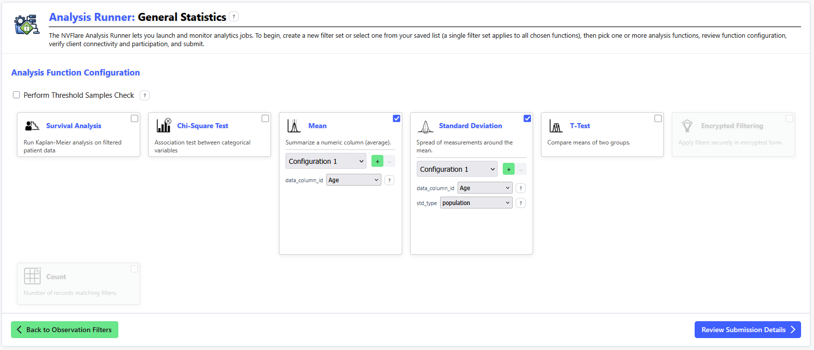

5. **Job submission** — the client snapshot should show `site1`, `site2`, `site3` connected, all
   contributing. Leave the participation checkboxes as they are and click **Submit for Analysis**.

   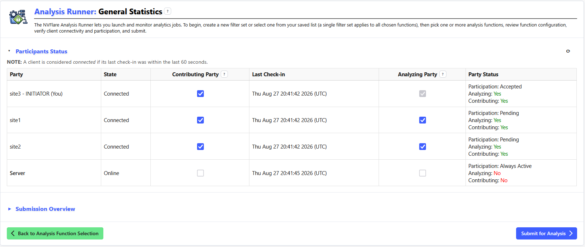

6. Wait for the job to reach **DONE** (a couple of minutes: multiparty key generation, one
   encrypted round per function), then click **View Analysis Results**.

### Expected results

| Metric | Aggregated value |
| --- | --- |
| Mean (Age) | **67.269** |
| Standard Deviation (Age) | **10.142** |

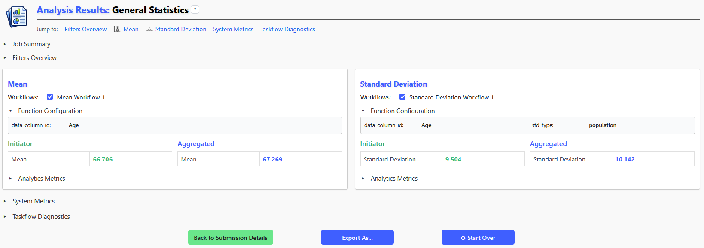

The aggregated values are identical at every site (each participant fuses the same decryption
shares), and identical across repeated runs of the job.

---

## Example 2: Biomarker Model Validation — survival analysis and calibration on MSKChord

**What it computes.** The flagship pipeline: the initiating site (`site3`) holds two prognostic
models trained on its own breast-carcinoma cohort — a Lasso Cox regression and a Lasso logistic
regression. The two participating sites score their own patients against each model and
contribute, per model, to both validation analyses:

- **Survival Analysis** — patients split into high-risk and low-risk arms at the model's cutoff,
  aggregated into a federated Kaplan-Meier curve with a log-rank test;
- **Exceptional Response Discrimination** — a federated estimate of the odds ratio per
  standard deviation of predictive model score for exceptional response (pooled logistic
  slope β₁ via inverse-variance meta-analysis).

All of this runs as **one job** (per-patient risk scores are computed once per model and shared
by both analyses), validating whether the initiator's models generalize without any site
exposing patient records.

This example uses the **Open-access** model mode (the model itself is shared in the clear, while
the score aggregation still runs under encryption). Open-access mode keeps each patient's
risk-group assignment exact, which is what makes the results below exactly reproducible;
see [Reproducibility notes](#reproducibility-notes).

### Steps

1. From the home page, open the **Biomarker Model Validation for Cancer Prognosis** project and
   click **Create New Filter Set** on the Filter History screen.

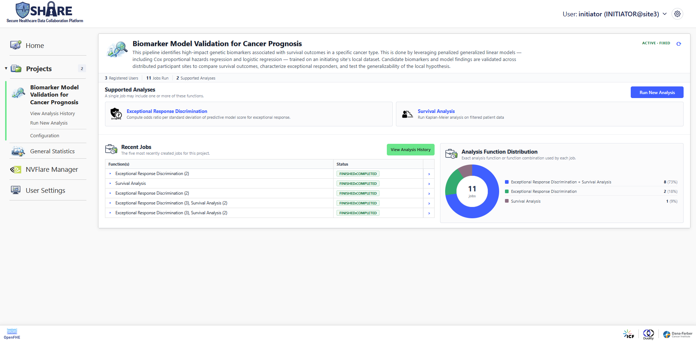

2. **Patient filters** — select datasource group **MSKChord** and cancer type
   **Breast Carcinoma**, preview the patient data, and continue.

   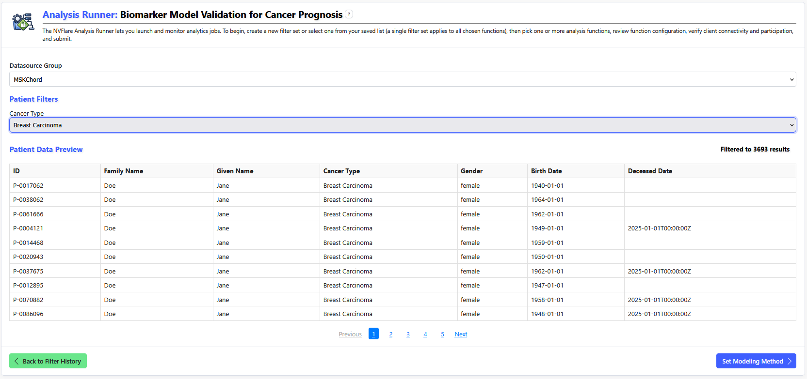

3. **Predictive Model Configuration** — select both **Lasso Cox Regression** and
   **Lasso Logistic Regression**, then continue. (Options are enabled only when weight and cutoff
   files are registered for the selected datasource group and cancer type; in the demo setup they
   are pre-registered for the `initiator` user.)

   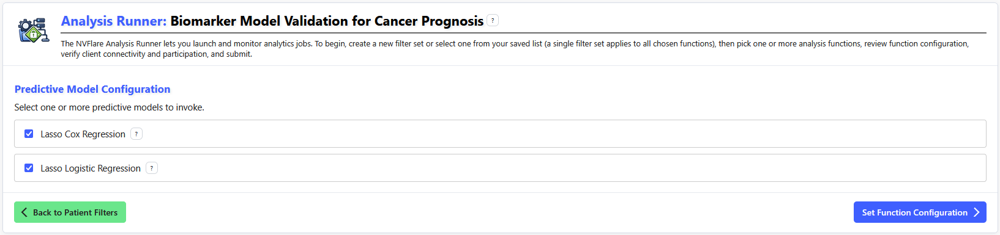

4. **Function selection** — select both **Survival Analysis** and
   **Exceptional Response Discrimination**, and set **model_type** to **Open-access** on each
   (the dropdown defaults to Encrypted). Keep the remaining defaults and leave the threshold
   disabled.

   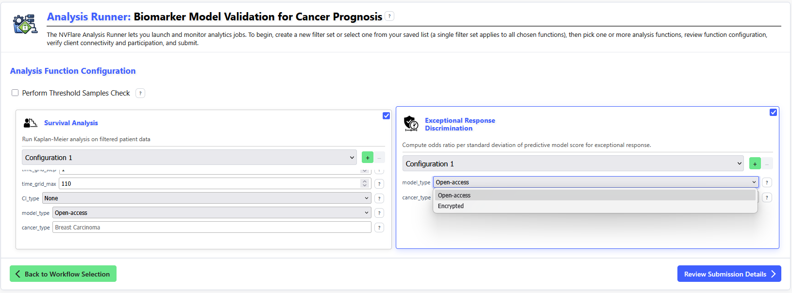

5. **Job submission** — in the client snapshot, **untick "Contributing" for `site3`**, the
   initiating site. The model was trained on `site3`'s cohort, so its data must not also be used
   to validate it; `site3` still participates in key generation and decryption. Then click
   **Submit for Analysis**.

   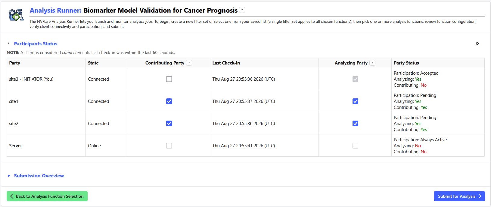

6. Wait for **DONE** (this chain runs key generation → model upload → per-site scoring, once per
   model → encrypted Kaplan-Meier and calibration aggregation) and open the results. This is the
   longest-running example — expect several minutes.

### Expected results

The report contains one section per model and analysis, over the `site1` + `site2` cohorts. It 
also shows the results obtained at the current viewer — the initiator.

**Survival Analysis.** The report shows a Kaplan-Meier plot per model: each curve tracks, over
time, the fraction of patients in one risk arm who are still alive: starting at 1.0 and
stepping down as deaths occur, so a curve that falls faster means earlier deaths. If the model's
risk split is meaningful, the high-risk curve should fall clearly below the low-risk curve. The
**log-rank test** quantifies that separation: it asks whether the two arms' survival differs by
more than chance, with a larger χ²(1) meaning stronger separation. The p-value is reported as
-log₁₀(p), so bigger is more significant — a value of 23 means p ≈ 10⁻²³.

Both models separate the risk arms decisively here — the initiator's hypothesis generalizes to
the other sites' cohorts:

| Metric (Aggregated) | Lasso Logistic | Lasso Cox |
| --- | --- | --- |
| P-value | **p < 0.005, -log₁₀(p) = 12.60** | **p < 0.005, -log₁₀(p) = 23.00** |
| χ²(1) | **53.6** | **100.8** |

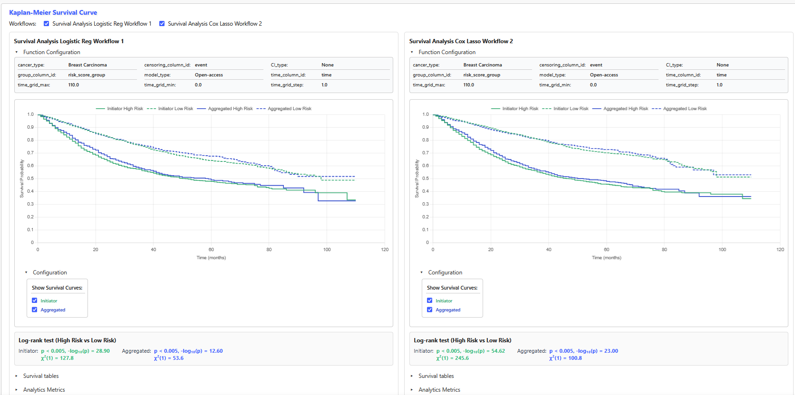

**Exceptional Response Discrimination.** This analysis checks how well the model's predicted risk
scores line up with actual patient outcomes in the validation cohorts. Each site fits a logistic
model of outcome against the risk score, and the per-site slopes are pooled into **β₁**, the log
odds ratio per standard deviation of model score for exceptional response: a
positive β₁ means patients the model scores as higher-risk really do fare worse, β₁ ≈ 0 means
the score carries no signal in these cohorts. SE(β₁) is the uncertainty of the pooled slope,
and z with its p-value (again shown as -log₁₀(p)) test whether the association could be chance;
a 95% confidence interval that excludes 0 confirms it.

Here β₁ is positive for both models, decisively so for the Cox model:

| Metric (Aggregated) | Lasso Logistic | Lasso Cox |
| --- | --- | --- |
| Pooled β₁ | **0.5061** | **0.9073** |
| Pooled SE(β₁) | **0.2437** | **0.3092** |
| Pooled z | **2.0769** | **2.9347** |
| Pooled p-value | **p > 0.005, -log₁₀(p) = 1.42** | **p < 0.005, -log₁₀(p) = 2.47** |
| 95% CI | **[0.0285, 0.9838]** | **[0.3013, 1.5133]** |

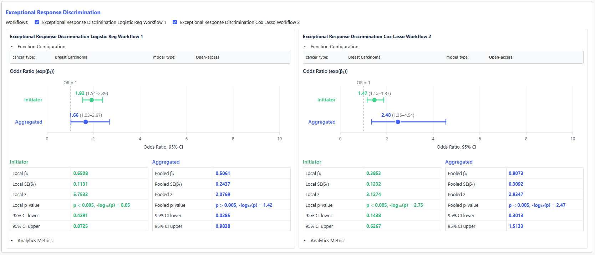

---

## Example 2b (variant): Encrypted model mode on Prostate Cancer

The same pipeline can run with the **Encrypted** model mode: the initiator uploads the 
model weights and cutoff as ciphertexts under the multi-party public key, the server 
computes each patient's risk score homomorphically, and neither the participants nor the 
server receive the weights in the clear.

One thing changes when scores are computed under encryption: each score picks up a tiny amount
of noise. For a patient whose score is almost exactly at the model's cutoff, that noise can tip
them into the other risk arm from one run to the next, which visibly shifts the log-rank result;
the log-rank statistic itself also carries a small amount of encryption noise. In other words, 
if patients' scores land closer than 1e-05 to the cut-off, we cannot guarantee that they 
will land in the same risk group as the cleartext version. Medically, a patient whose score
sits essentially on the decision boundary is an ambiguous call to begin with — the model's
own uncertainty about them dwarfs the tiny encryption noise — so such borderline assignments
already carry uncertainty in practice.

Repeat the steps of Example 2 with three changes:

1. On the patient filter screen, select cancer type **Prostate Cancer** (datasource group
   **MSKChord** as before).
2. Keep both models selected in Predictive Model Configuration.
3. In function selection, select both functions but leave **model_type** at its default,
   **Encrypted** — no dropdown change needed, and select **Perform Threshold Samples Check**,
   which aborts the computation if there are fewer than the selected threshold of patients across 
   the validation sites. In practice, this threshold is at most 20. This threshold check can be 
   done either in a **Protected** mode (the server does not see the total count) or in an 
   **Exposed** mode (the server sees the total count).

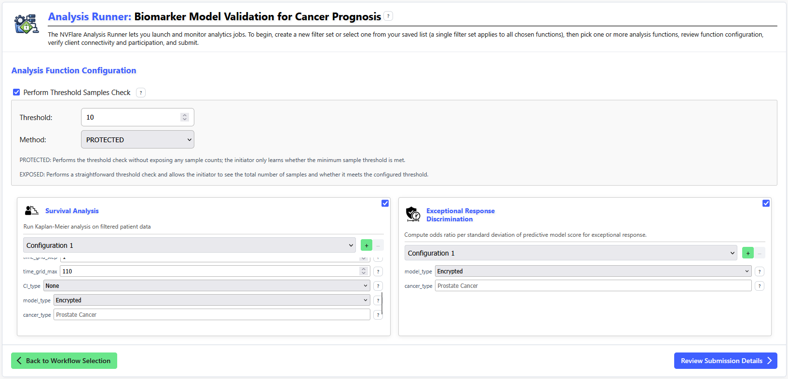

Remember to untick "Contributing" for `site3` at submission, as in Example 2. The job runs
longer than the open-access one (homomorphic scoring against the encrypted model and protected 
threshold check).

### Expected results

| Metric (Aggregated) | Lasso Logistic | Lasso Cox |
| --- | --- | --- |
| KM P-value | **p < 0.005, -log₁₀(p) = 16.30** | **p < 0.005, -log₁₀(p) = 19.30** |
| KM χ²(1) | **70.4** | **84.0** |
| Pooled β₁ | **0.7611** | **0.6741** |
| Pooled SE(β₁) | **0.2399** | **0.2317** |
| Pooled z | **3.1722** | **2.9092** |
| Pooled p-value | **p < 0.005, -log₁₀(p) = 2.82** | **p < 0.005, -log₁₀(p) = 2.44** |
| 95% CI | **[0.2908, 1.2313]** | **[0.2199, 1.1282]** |

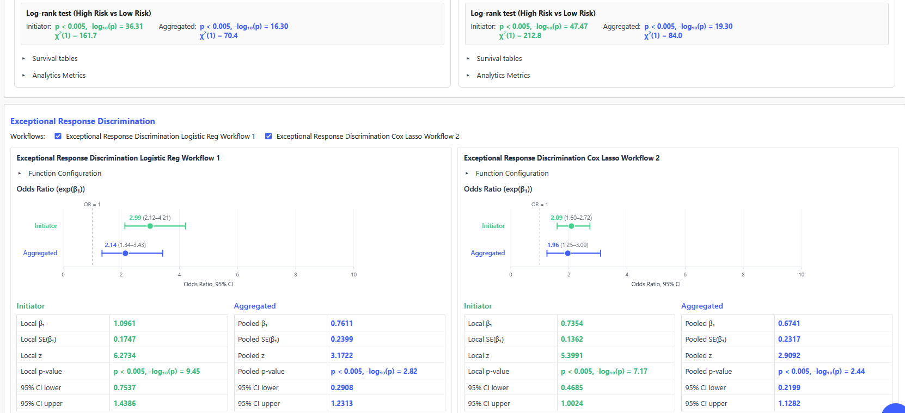

---

## Reproducibility notes

The privacy masks are drawn fresh on every run and CKKS arithmetic is approximate, so raw
aggregates differ across runs at a small scale. Whether a *displayed* value is reproducible
depends on how far that noise sits below the viewer's display precision. 

When adapting these walkthroughs, avoid configurations whose noise reaches the displayed digits.
The known cases, all measured on this stack:

- The **chi-square statistic** is displayed with 3 decimals but the encrypted chain only
  guarantees ~2, so its last displayed digit can flip between runs.
- In **Encrypted** model mode, a patient whose risk score is almost exactly at the cutoff can
  change risk arm between runs (a visible jump in the log-rank result), and the log-rank
  statistic itself carries a small noise of its own — enough to flip a displayed digit when the
  value happens to sit right on a rounding boundary. Pick a cohort where neither is the case;
  the calibration statistics are unaffected either way.
